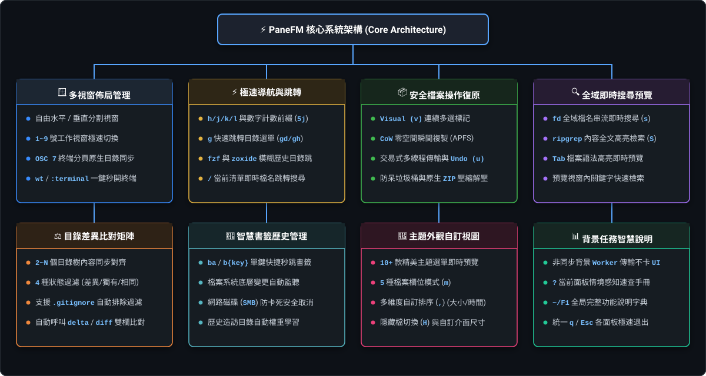

# PaneFM (Pane File Manager)

<p align="center">
  <br>
  <b>⚡ 極速、Vim 操控手感、多視窗與 N-Way 差異比對的現代化終端檔案管理器</b><br>
  <sub>專為追求高效鍵盤流、多目錄並行管理與無縫終端整合的開發者打造</sub>
</p>

<p align="center">
  <a href="https://github.com/winthropchang/panefm/actions/workflows/ci.yml"></a>
  <a href="https://github.com/winthropchang/panefm/releases"></a>
  
  
  
  
</p>

---

## 🗺️ 全功能架構圖解（Core Architecture）

PaneFM 以 **8 大核心系統** 為基石，提供從極速導航、多視窗分割、安全檔案交易到深度系統整合的完整體驗：

<p align="center">
  
</p>

| 🪟 多視窗佈局 | ⚡ Vim 導航跳轉 | 📦 安全檔案操作 | 🔍 全域搜尋預覽 |
|:---|:---|:---|:---|
| • 自由水平/垂直分割<br>• 1~9 視窗秒切<br>• 原生終端分頁同步 | • `h/j/k/l` & 數字 Count<br>• `g` 快速跳轉目錄<br>• `fzf` / `zoxide` / `List Find` | • 視覺多選 (`v`) / 安全貼上<br>• CoW 零空間瞬間複製<br>• 交易式 Undo / 垃圾桶 | • `fd` 檔名串流搜尋<br>• `rg` 內容全文檢索<br>• `Tab` 檔案語法預覽 |

| ⚖️ 目錄差異矩陣 | 🔖 智慧書籤歷史 | 🎨 主題外觀視圖 | 📊 任務與說明 |
|:---|:---|:---|:---|
| • 2~N 目錄同時對齊<br>• 4 種狀態差異過濾<br>• 呼叫外部比對器 (`delta`) | • 單鍵快捷秒跳書籤<br>• 檔案系統自動監聽<br>• 網路磁碟防卡死取消 | • 10+ 款精美主題<br>• 動態即時預覽切換<br>• 5 種欄位顯示模式 | • 背景 Worker 傳輸不卡 UI<br>• `?` 當前面板情境速查<br>• 統一 `q`/`Esc` 退出 |

---

## 🚀 8 大核心系統亮點

### 1. 🪟 多視窗與分割佈局（Multi-Pane Layout）

* **自由分割與管理**：支援水平分割（`Ctrl+s` / `ws`）與垂直分割（`Ctrl+v` / `wv`），可依需求開啟 1~9 個 Panel。
* **獨立工作狀態**：每個 Panel 獨立維護專屬工作目錄、游標位置、選取項目、即時過濾條件與預覽視窗。
* **100% 原生終端同步**：內建 **OSC 7 目錄廣播**，在 iTerm2、WezTerm、Windows Terminal 等終端按下原生開新分頁快捷鍵時，新分頁會**自動進入目前 Panel 所在目錄**！
* **一鍵喚醒終端（`wt` / `:terminal`）**：自動識別當前終端環境（WezTerm、Alacritty、iTerm2、Ghostty、Kitty、Windows Terminal），秒開獨立控制台。

### 2. ⚡ 極速 Vim 導航與智慧跳轉（Navigation & Jump）

* **純正 Vim 移動**：`h/j/k/l`、`gg/G`、半頁翻滾 `Ctrl+d`/`Ctrl+u`，支援 **數字 Count 前綴**（如 `5j` 向下 5 行、`10k` 向上 10 行）。
* **快速跳轉選單（`g`）**：`gd`（Documents）、`gk`（Desktop）、`gh`（家目錄）、`gt`（直接輸入路徑跳轉）。
* **四大搜尋跳轉神器**：
  * `/` **List Find**：在目前目錄即時跳轉檔名，按 `n` / `N` 跳至下一個/上一個。
  * `f` / `F` **Filter**：即時過濾目前清單（`Tab` 切換一般/模糊過濾）。
  * `z` **Fzf Jump**：整合 `fzf` 進行目錄樹互動式模糊搜尋。
  * `Z` **Zoxide Jump**：整合 `zoxide` 學習並秒跳常用歷史目錄。

### 3. 📦 安全檔案操作與復原系統（File Operations & Undo）

* **視覺連續多選（`v` / `V`）**：如同 Vim Visual Mode，快速連續標記多筆檔案；亦支援 `Space` 單選與 `Ctrl+a` 全選。
* **CoW (Copy-on-Write) 零空間瞬間複製**：在 macOS（APFS）或支援 Reflink 的檔案系統上，複製數十 GB 巨型檔案**瞬間完成且零耗硬碟空間**。
* **交易式安全傳輸與 Undo（`u`）**：多線程並行複製，具備失敗自動清理半殘檔機制；支援多達 20 筆操作歷史的連續撤銷。
* **批次與命名工具**：`r` 原地改名（支援 Vim 二段式編輯）、`R` / `:reg` **Regex 批次改名預覽面板**、`a` 快速建立（結尾 `/` 自動建目錄）。
* **全功能垃圾桶（`d` / `gt`）**：安全移至垃圾桶，獨立垃圾桶面板支援一鍵還原或永久刪除。
* **原生免相依壓縮（`C` / `E`）**：純 Rust 內建 ZIP 壓縮與解壓縮（支援 zip, tar.gz, tar, gz），無須安裝外部工具。

### 4. 🔍 全域即時搜尋與檔案預覽（Global Search & Preview）

* **`s` Filename Search**：整合 `fd` 進行全域檔名串流即時搜尋。
* **`S` Content Search**：整合 `ripgrep (rg)` 進行全文內容檢索，右側支援即時內容比對與高亮。
* **`Tab` 檔案預覽**：支援語法高亮、`j`/`k` 捲動瀏覽與 `/` 預覽內關鍵字搜尋。

### 5. ⚖️ N-Way 目錄差異比對矩陣（Diff Matrix - `Alt+d` / `:diff`）

* **多目錄同步比對神器**：同時對齊比對 2 ~ N 個 Panel 的目錄樹與檔案內容。
* **4 種狀態過濾**：按 `f` 循環切換（全部 ➔ 僅差異 ➔ 僅獨有 ➔ 完全相同）。
* **智慧過濾與外部整合**：`i` 即時切換 `.gitignore` 排除規則；選取相異檔案按 `Enter` 自動呼叫 `delta`、`difftastic` 或 `vimdiff` 查看詳細雙欄比對。

### 6. 🔖 智慧書籤與歷史管理（Bookmarks & History）

* **單鍵秒跳（`b`）**：`ba` 自動分配代號新增書籤，`b{key}` 按單鍵直接秒跳至對應目錄，`bg` 開啟書籤清單。

### 7. 🎨 豐富佈景主題與自訂視圖（Themes & View）

* **10+ 款高質感主題（`t`）**：內建 Gruvbox, Catppuccin, TokyoNight, Nord, Dracula, Solarized, Monokai 等，**選單即時動態預覽**。
* **欄位與排序切換**：`,` 排序選單（名稱、大小、時間、副檔名、反向）；`m` 欄位顯示模式（大小、權限、建立時間、修改時間、精簡）。

### 8. 📊 背景非同步任務與智慧說明（Tasks & Help）

* **背景 Worker（`T`）**：大檔案複製、壓縮於背景非同步執行，UI 永不卡頓；隨時檢視進度速率與取消任務。
* **`?` 情境感知速查表（Context Cheatsheet）**：自動依據您目前所在的畫面，**精準列出當下可用的快捷鍵**！
* **`~/F1` 全局字典手冊**：完整指令手冊與功能說明，支援關鍵字搜尋。
* **統一快速離開鍵（`q` / `Esc`）**：在所有面板、預覽、對話框與輸入框 Normal 模式下，按 `q` 均可一鍵快速退出！

---

## 💡 10 秒快速上手（口訣與精選鍵位）

> 記住這 6 招，立刻流暢上手：
>
> 1. **看按鍵**：隨時按 **`?`**（看目前面板可用鍵）或 **`F1`**（看全部）。
> 2. **退出/返回**：按 **`q`** 或 **`Esc`**。
> 3. **找檔案**：**`s`**（找檔名）、**`S`**（找內容）、**`/`**（當前目錄找）、**`z`**（模糊跳轉）。
> 4. **選檔案**：**`Space`**（單選）、**`v`**（連續連選）、**`Ctrl+a`**（全選）。
> 5. **檔案操作**：**`y`**（複製）、**`x`**（剪下）、**`p`**（貼上）、**`r`**（改名）、**`d`**（刪除）、**`u`**（復原）。
> 6. **多視窗**：**`Ctrl+v`**（開垂直視窗）、**`1..9`**（切換視窗）。

### 常用快捷鍵速查表

| 類別 | 快捷鍵 | 功能說明 |
|---|---|---|
| **移動導航** | `h/j/k/l` | 上一層 / 向下 / 向上 / 進入目錄（支援數字前綴，如 `5j`） |
| | `gg` / `G` | 跳至頂部 / 跳至底部 |
| | `Ctrl+d` / `Ctrl+u` | 向下半頁 / 向上半頁 |
| | `g` | 開啟快速跳轉選單（`gd` 文件、`gk` 桌面、`gh` 家目錄、`gt` 輸入路徑） |
| **搜尋過濾** | `s` / `S` | 全域檔名搜尋 (`fd`) / 全文內容檢索 (`rg`) |
| | `/` | 檔名即時搜尋（`n` / `N` 跳轉下一個/上一個） |
| | `f` | 即時過濾清單（`Tab` 切換一般/模糊過濾） |
| | `z` / `Z` | `fzf` 目錄樹模糊跳轉 / `zoxide` 歷史目錄跳轉 |
| **檔案操作** | `Space` / `v` | 單檔標記 / 進入連續範圍選取模式 |
| | `y` / `x` / `p` | 複製 / 剪下 / 安全貼上（`P` 強制覆蓋） |
| | `r` / `R` | 原地重新命名 / Regex 批次改名預覽面板 |
| | `a` | 建立檔案或資料夾（名稱以 `/` 結尾自動建為目錄） |
| | `d` / `D` | 移至垃圾桶 / 永久刪除 |
| | `u` | 交易式復原（Undo 上一步複製或移動） |
| | `C` / `E` | 壓縮為 ZIP / 解壓縮檔案 |
| **視窗與比對**| `Ctrl+v` / `Ctrl+s` | 垂直分割新視窗 / 水平分割新視窗 |
| | `1` ~ `9` | 直接切換至指定編號的視窗 |
| | `w` | 開啟視窗管理選單（`wc` 關閉、`wo` 獨佔、`wt` 開新終端） |
| | `Alt+d` / `wd` | 開啟多視窗 **N-Way Diff 矩陣比對** |
| **預覽與輔助**| `Tab` | 開啟/關閉檔案內容預覽（進入後可用 `j/k` 捲動、`/` 搜尋） |
| | `t` / `,` / `m` | 主題切換（即時預覽） / 排序選單 / 欄位顯示模式 |
| | `T` | 開啟背景任務管理面板 |
| | `?` / `F1` | 當前面板情境速查（Cheatsheet） / 全局完整說明字典 |
| | `q` | 離開目前面板 / 退出 PaneFM |

---

## 🛠️ 安裝方式

### 1. 必要環境

PaneFM 需要由系統 `PATH` 調用以下外部加速工具：

* **Rust 1.85+**（原始碼編譯需要）
* **`fd`**（全域檔名搜尋）
* **`ripgrep`**（執行指令為 `rg`，全域內容檢索）
* **`fzf`**（模糊跳轉）
* **`zoxide`**（歷史目錄學習）

**macOS (Homebrew)**：

```bash
brew install fd fzf ripgrep zoxide
```

**Windows (WinGet / Scoop / Chocolatey)**：

```powershell
winget install sharkdp.fd BurntSushi.ripgrep.MSVC junegunn.fzf ajeetdsouza.zoxide
```

> 💡 啟動 PaneFM 後可輸入 `:status` 檢查目前外部工具的安裝狀態。

---

### 2. 下載預先編譯版本（GitHub Releases）

至 [Releases 頁面](https://github.com/winthropchang/panefm/releases) 下載對應作業系統的預先編譯執行檔：

* **macOS (Apple Silicon / M 系列)**：`panefm-macos-arm64`
* **macOS (Intel)**：`panefm-macos-x86_64`
* **Windows (x64)**：`panefm-windows-x86_64.exe`

#### 🍎 macOS 使用者注意事項（Gatekeeper 隔離解除）

由於 GitHub Releases 的二進位檔案未經 Apple 開發者付費簽名，macOS 下載後會自動加上隔離標記，初次執行可能會跳出 `Apple could not verify "panefm..."` 的阻擋警告。

請在 Terminal 執行以下指令移除隔離標記並加入系統路徑：

```bash
# 1. 移除 macOS 下載隔離標記（請替換為您下載的檔名）
xattr -d com.apple.quarantine ./panefm-macos-arm64

# 2. 賦予執行權限
chmod +x ./panefm-macos-arm64

# 3. 移至系統 PATH（即可隨時輸入 panefm 啟動）
sudo mv ./panefm-macos-arm64 /usr/local/bin/panefm
```

> 💡 **圖形介面解法**：亦可前往 macOS **「系統設定」➔「隱私權與安全性」**，在安全性區塊點擊 **「強制打開（Open Anyway）」**。

---

### 3. 從原始碼編譯安裝

```bash
git clone https://github.com/winthropchang/panefm.git
cd panefm
cargo build --release
```

編譯完成的執行檔位於：

* **macOS**：`target/release/panefm`
* **Windows**：`target\release\panefm.exe`

將其加入系統 `PATH` 後，即可在任何終端中輸入 `panefm` 啟動！

---

## ⚙️ 外掛擴充與自訂動作 (`plugins.toml`)

PaneFM 支援透過 `plugins.toml` 自由擴充**終端適配器**與 **`Open with` 外部動作**，無須修改原始碼或重新編譯。

詳細設定請參考 [plugins.toml.example](plugins.toml.example)。

### 1. 自訂終端適配器 (`[[terminals]]`)

當按下 **`wt`** 或輸入 **`:terminal`** 時，系統會自動根據當前環境變數或程序樹喚起對應終端：

```toml
# 範例 1：macOS Kitty 終端（在現有視窗直接開新 Tab）
[[terminals]]
name = "kitty"
match_env = ["KITTY_WINDOW_ID", "KITTY_PID"]
match_process = ["kitty"]
mac_command = "kitty @ launch --type=tab --cwd={path}"

# 範例 2：跨平台 Ghostty 終端（開新視窗並定位至當前目錄）
[[terminals]]
name = "ghostty"
match_env = ["GHOSTTY_RESOURCES_DIR"]
match_process = ["ghostty.exe", "ghostty"]
mac_command = "open -a Ghostty {path}"
windows_command = "ghostty.exe --working-directory {path}"

# 範例 3：企業 TrustView 加密保護終端（安全權杖繼承）
[[terminals]]
name = "trustview-safe-terminal"
match_env = ["TRUSTVIEW_SESSION"]
windows_command = "TrustViewLauncher.exe --cwd {path}"
```

### 2. 自訂 `Open with` 動作 (`[[actions.open_with]]`)

按下 `O` 或 `Shift+Enter` 即可呼叫自訂動作選單：

```toml
[[actions.open_with]]
name = "VS Code"
scope = "dir"
mode = "detached"
mac_command = "open -a 'Visual Studio Code' {path}"
windows_command = "code {path}"

[[actions.open_with]]
name = "Git log"
scope = "both"
mode = "terminal"
command = "git -C {parent} log --oneline"
```

---

## 📖 設定檔 (`config.toml`)

詳細設定請參考 [config.toml.example](config.toml.example)。設定檔讀取順序：

1. `PANE_FM_CONFIG` 環境變數指定的檔案
2. 目前目錄的 `config.toml`
3. macOS：`~/.config/panefm/config.toml` 或 `$XDG_CONFIG_HOME/panefm/config.toml`
4. Windows：`%APPDATA%\panefm\config.toml`

可自由調整預設主題、隱藏檔顯示、排序偏好、移動步長與介面尺寸。

---

## 💖 Vibe Coding 專案故事

PaneFM 是一個以 **Vibe Coding** 方式開發的軟體，也是我嘗試使用 AI 建立自己真正會每天使用之終端生產力工具的專案。

功能方向、操作流程與使用體驗來自真實開發痛點與需求；程式碼則透過與 AI 持續對話、架構設計、實作、嚴格測試（**450+ 自動化測試保護**）逐步打磨而成。希望這款工具能讓每一位熱愛命令列與鍵盤流的開發者感受到極致流暢的操作樂趣！

---

## 📄 License

MIT License. 歡迎貢獻、回報 Issue 與提 PR！
